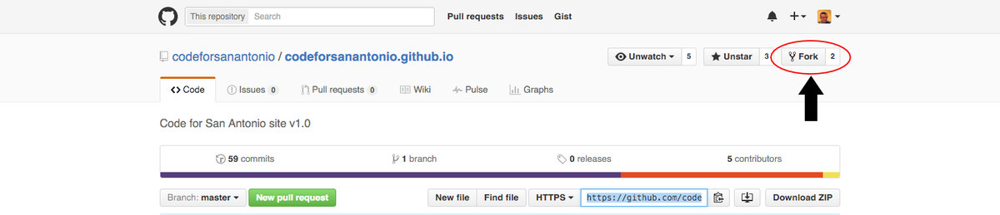

# Contributing

Working on projects for Code For San Antonio is a collaborative effort. In an attempt to make this process as simple as possible for everyone, we have set some guidelines for contributing to projects. First and foremost, you must understand our [license] and our code of conduct.

[license]: https://github.com/codeforsanantonio/codeforsanantonio.github.io/blob/master/LICENSE

We will use the [Code For San Antonio] repository as an example, but these same steps apply to any project of ours that you wish to contribute to!

[Code For San Antonio]: https://github.com/codeforsanantonio/codeforsanantonio.github.io

First, navigate to the repository on github and **fork** the repository.




<br>Then, clone the repository into a directory on your machine.
```
git clone your-ssh/git-url
```

<br>Next, you will want to create a **branch** so that it is easier to organize your contributions. Let's use our first name for the branch name.
```
git checkout -b your-first-name
```

<br>You are now ready to make your contributions! When you have finished and are ready to commit them, you will simply do...
```
git add -A
```
This will add every file that you have changed, or added, that is different from the master branch.

<br>

###*Contribute in the style of the project to the best of your abilities.* *This may mean using indents, semi colons or comments differently than you would in your own repository, but makes it easier for the maintainer to merge and for others to understand and maintain in the future.*

<br>

Next, you will do a commit.
```
git commit -m "Your Commit Message Here..."
```
Make sure that your commit message is clear, concise and in the present tense (Ex. "Add new about page" instead of "Added new about page")


<br>Once your commit message has been set, you will then execute
```
git push origin your-branch-name
```
This will push your changes up to your **forked** repository. From here, the final step to contribution is to create a **pull** request.

To do this, click on the green *New pull request* button on **your** forked repository page! On the next page, you will make sure that the **base fork** and **base** dropdowns both show the *master* branch and that **head fork** and **compare** both show your forked repository and branch, respectively.
Once that is done, you wait until the project manager reviews your request and decided whether or not to merge your changes.

# Keeping Your Fork Updated

While this step isn't completely neccessary, it can definitely save your a lot of time and headache if you will be making multiple contributions as opposed to a few small tweaks. So far, the easiest way to keep your locally cloned repository updated with the master is to simply delete the fork and local clone, then refork and clone the master. However, this is not the only way to keep updated!

Using the following commands, we will be adding the **upstream**, or original project, as a remote branch. This will bring their *updates* into our branch locally. Replace the below *upstream-name* and *project-name* values with the actual *user*/*project* name that you wish to track. Please make sure that you are in the **master** branch of your local repository before doing this.
```
git remote add --track master upstream git://github.com/upstream-name/project-name.git
```

<br>This will add the original project as a remote named **upstream**. To then get the updates, type:
```
git fetch upstream
```

<br>Finally, to merge the updates into your own project, type:
```
git merge upstream/master
```

<br>Congratulations! You now have an up-to-date version of the master repository in your current branch. Just remember to do this before you start any new contributions! Also, make sure to switch to your new branch before making changes. This helps keep the master branch of your local repository clean.
